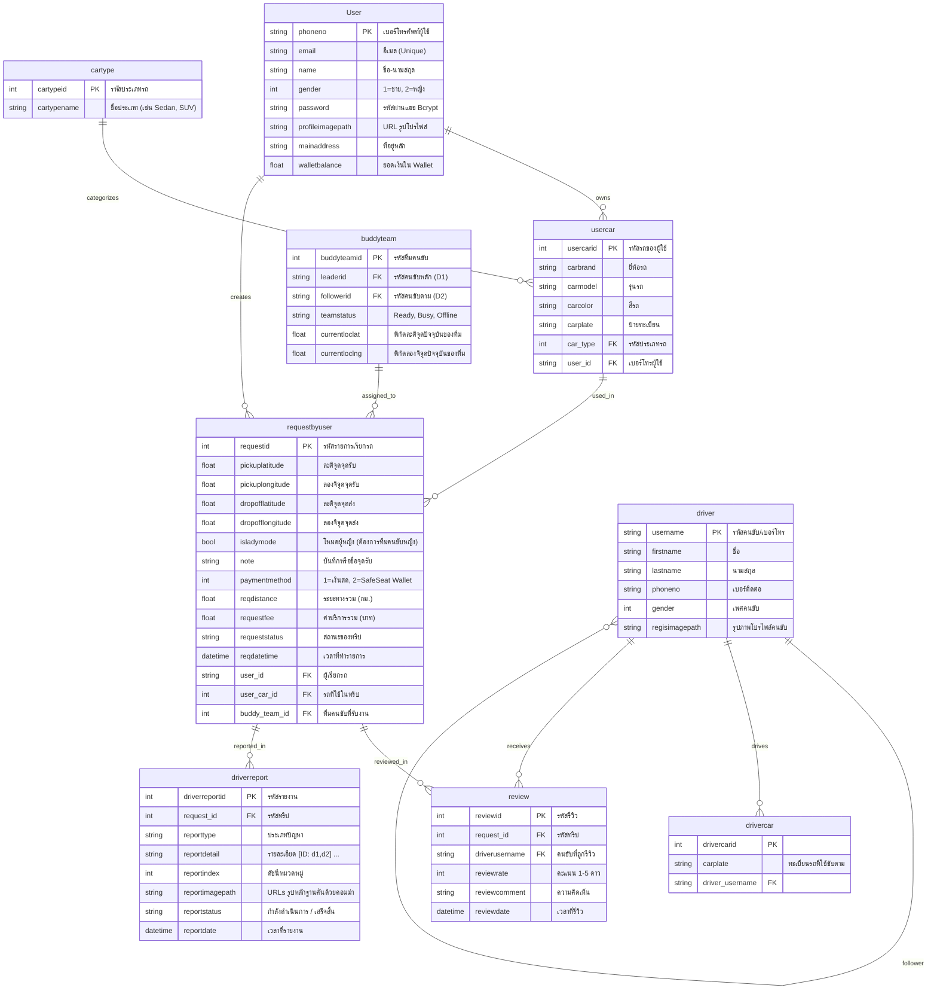

# 🚗 SafeSeat Mini — ระบบแอปพลิเคชันเรียกรถแทนผู้โดยสาร (User App & Backend)

> **เอกสารภาพรวมระบบ สถาปัตยกรรม ฐานข้อมูล และกระบวนการทำงานทั้งหมดของโปรเจกต์**  
> จัดทำขึ้นเพื่อเป็นสรุปอ้างอิงกลาง (Single Source of Truth) สำหรับการพัฒนาต่อยอด โดยครอบคลุมทั้งส่วนโมบายล์แอปพลิเคชันฝั่งผู้ใช้งาน (**Flutter**) และระบบเซิร์ฟเวอร์หลังบ้าน (**Node.js/Express + Supabase**)

---

## 1. 📌 ภาพรวมและคอนเซปต์ของโปรเจกต์ (Core Concept)

**SafeSeat** คือแพลตฟอร์มให้บริการ **"คนขับรถแทนผู้โดยสาร" (Designated Driver & Safety On-Demand Service)** สำหรับผู้ใช้บริการที่นำรถส่วนตัวออกไปสังสรรค์หรือทำธุระในยามค่ำคืน แล้วไม่สะดวกหรือไม่สามารถขับรถของตัวเองกลับได้

### 👥 รูปแบบการทำงานของทีมคนขับแบบคู่ (Dual-Driver Buddy Team)
จุดเด่นสำคัญของ SafeSeat คือการจัดส่งคนขับแบบ **"ทีมคู่หู 2 คน" (Buddy Team)** เสมอ:
1. **คนขับหลัก (Leader / D1 - Driver Your Car):** เป็นคนขับที่จะขึ้นไปขับ **"รถของผู้ใช้บริการ"** โดยพาผู้ใช้บริการนั่งกลับไปยังจุดหมายปลายทางอย่างปลอดภัย
2. **ผู้ช่วยคนขับ / ผู้ติดตาม (Follower / D2 - Driver Follower):** เป็นคนขับที่จะขับ **"รถ/มอเตอร์ไซค์ของทีมคนขับเอง"** ขับตามหลังรถของผู้ใช้บริการมา เพื่อรับคนขับหลัก (Leader) กลับหลังส่งผู้ใช้บริการถึงบ้านเรียบร้อยแล้ว

> **ขอบเขตความรับผิดชอบในโปรเจกต์นี้:**  
> เราดูแลเฉพาะ **ฝั่งผู้ใช้งาน (Client / User App - `safeseat_mini`)** และ **ระบบ Backend API (`safeseat_backend`)** เท่านั้น *(ไม่ได้รับผิดชอบในส่วน Driver App)*

---

## 2. 🛠️ Tech Stack & เทคโนโลยีที่ใช้งาน

### 📱 โมบายล์แอปพลิเคชันฝั่ง User (`safeseat_mini`)
- **Framework:** Flutter (Dart SDK ^3.10.4)
- **Architecture Pattern:** Feature-First Clean Architecture (จัดกลุ่มโค้ดตามฟีเจอร์)
- **State Management:** Flutter Riverpod 3.x (`NotifierProvider`, `FutureProvider`, `FutureProvider.family`, `ProviderScope`)
- **Maps & Geolocation:** `flutter_map` 8.x (OpenStreetMap Tiles), `latlong2`, `geolocator`
- **Routing & Navigation Calculation:** OSRM (Open Source Routing Machine) ผ่าน `RouteService`
- **Cloud & Storage:** `supabase_flutter` (เชื่อมต่อ Supabase Storage Bucket `images`), REST API (`http`)
- **UI & Interaction:** Google Fonts (`Kanit`), `image_picker` (อัปโหลดรูปภาพหลักฐาน/โปรไฟล์), `share_plus` (แชร์ลิงก์ทริปสด)

### 🖥️ เซิร์ฟเวอร์หลังบ้าน (`safeseat_backend`)
- **Runtime & Framework:** Node.js (Express 5.2.1)
- **Database & Storage:** Supabase PostgreSQL & Supabase Storage Bucket
- **Real-time Dispatcher:** Supabase Realtime Channels (`DispatcherService`) สำหรับตรวจจับงานใหม่และกระจายงาน (Broadcast) ไปยังทีมคนขับที่ใกล้ที่สุด
- **Security & Utilities:** `bcrypt` (แฮชรหัสผ่าน 10 rounds), `multer` (รับไฟล์อัปโหลด), `cors`, `dotenv`
- **External Integration:** SerpApi (Google Maps Search API) สำหรับค้นหาพิกัดและชื่อสถานที่

---

## 3. 🏗️ โครงสร้างโปรเจกต์ (Project Directory Structure)

```text
SafeSeatMini/
├── safeseat_backend/                    # Node.js Express REST API & Dispatcher
│   ├── src/
│   │   ├── config/
│   │   │   └── supabase.js             # Supabase Client Initialization
│   │   ├── controllers/
│   │   │   ├── admin/                  # Admin Management Controllers
│   │   │   ├── driver/                 # Driver API Controllers & Incident Reports
│   │   │   ├── pub/                    # Partner Pub/Venue Controllers
│   │   │   └── user/                   # User API Controllers
│   │   │       ├── auth.controller.js      # เข้าสู่ระบบ / สมัครสมาชิก
│   │   │       ├── location.controller.js  # ค้นหาพิกัดผ่าน SerpApi
│   │   │       ├── profile.controller.js   # โปรไฟล์ผู้ใช้ & ข้อมูลรถ
│   │   │       ├── request.controller.js   # จัดการการเรียกรถ & ทริป
│   │   │       └── review.controller.js    # รีวิวและให้คะแนนคนขับ
│   │   ├── routes/                     # Express Routes (แยกตาม user, driver, pub, admin)
│   │   ├── services/
│   │   │   ├── dispatcherService.js    # ระบบ Realtime Dispatcher จับคู่งานอัตโนมัติ
│   │   │   └── user/                   # Business Logic Layer ของ User
│   │   └── utils/
│   │       └── supabaseStorage.js      # Helper อัปโหลดไฟล์ขึ้น Supabase Storage
│   └── package.json
│
└── safeseat_mini/                       # Flutter Mobile Application (User Facing)
    └── lib/
        ├── main.dart                   # จุดเริ่มต้นแอป (Supabase & Riverpod Init)
        ├── core/                       # แกนกลางของระบบ
        │   ├── constants/              # ค่าคงที่ (API Base URL)
        │   ├── controllers/            # Global State Controllers (User Session)
        │   ├── services/               # Services ทั่วไป (OSRM Route Service)
        │   ├── theme/                  # โทนสีและ Design System ของแอป
        │   └── utils/                  # Form Validators & Helpers
        ├── data/                       # Data Layer
        │   ├── models/                 # Data Models
        │   │   ├── user_model.dart             # ข้อมูลผู้ใช้งาน & กระเป๋าเงิน
        │   │   ├── car_model.dart              # ข้อมูลรถยนต์ของผู้ใช้
        │   │   ├── cartype_model.dart          # ประเภทรถยนต์ (Sedan, SUV ฯลฯ)
        │   │   ├── request_driver_model.dart   # ข้อมูลคำขอเรียกรถ, BuddyTeam, DriverProfiles
        │   │   ├── review_model.dart           # ข้อมูลการรีวิวคนขับ
        │   │   └── driver_report_model.dart    # ข้อมูลการรายงานเหตุการณ์คนขับ
        │   └── repositories/           # เชื่อมต่อ REST API หลังบ้าน
        │       ├── auth_repository.dart
        │       ├── profile_repository.dart
        │       └── request_driver_repository.dart
        └── features/                   # หน้าจอและ Logic แยกตามฟังก์ชันการทำงาน
            ├── auth/                   # เข้าสู่ระบบ & สมัครสมาชิก
            ├── home/                   # หน้าแดชบอร์ดหลัก & แบนเนอร์บริการ
            ├── main_layout/            # Bottom Navigation Bar (4 แท็บหลัก)
            ├── profile/                # จัดการโปรไฟล์, จัดการรถยนต์, SafeSeat Wallet
            ├── request_driver/         # ระบบเรียกรถ, ปักหมุด, ค้นหาคนขับ, Live Tracking
            └── history/                # ประวัติการเดินทาง, รีวิวคู่หูคนขับ, รายงานปัญหา
```

---

## 4. 🗄️ โครงสร้างฐานข้อมูล Supabase (Database Schema & Relations)



---

## 5. 🔄 กระบวนการทำงานหลักในระบบ (Key Workflows & Features)

### 1. ระบบยืนยันตัวตน (Authentication Flow)
- **เข้าสู่ระบบ (`login_screen.dart`):** ล็อกอินด้วยเบอร์โทรศัพท์และรหัสผ่าน Backend จะตรวจสอบแฮชด้วย Bcrypt หากถูกต้องจะส่งข้อมูล Profile (ไม่รวม password) กลับมาเก็บใน `userProvider`
- **สมัครสมาชิก (`register_screen.dart`):** ตรวจสอบเบอร์โทรไม่ซ้ำ ตรวจสอบรูปแบบรหัสผ่าน (ความยาว 8-50 ตัวอักษร) แฮชรหัสผ่าน และบันทึกลงตาราง `User`

### 2. กระบวนการเรียกรถ (Driver Request Flow)
1. **เลือกจุดรับ-ส่งบนแผนที่ (`request_driver_screen.dart` & `select_location_screen.dart`):**
   - สามารถปักหมุดบนแผนที่ หรือค้นหาชื่อสถานที่ผ่าน SerpApi
2. **สรุปรายละเอียดและคำนวณราคา (`request_driver_details_screen.dart`):**
   - **เลือกยานพาหนะ:** ดึงรายการรถที่ผู้ใช้บันทึกไว้ในตาราง `usercar` มาให้เลือก
   - **Lady Mode:** สวิตช์เลือกทีมคนขับที่เป็นผู้หญิงทั้งคู่ เพื่อความสบายใจของผู้โดยสารหญิง
   - **การคำนวณราคา:** คำนวณเส้นทางจริงผ่าน OSRM `RouteService` ด้วยสูตร:
     $$\text{ราคาประเมิน} = 300 + (\text{ระยะทาง (กม.)} \times 10)$$
   - **การชำระเงิน & ตรวจสอบยอดเงิน:** รองรับ เงินสด (1) และ SafeSeat Wallet (2) หากเลือก Wallet ระบบจะตรวจสอบว่า `walletBalance >= ค่าบริการ` หรือไม่ หากไม่พอจะมี Dialog แจ้งเตือนและให้สลับเป็นเงินสด
3. **การจับคู่คนขับอัตโนมัติ (`waiting_driver_screen.dart` & `dispatcherService.js`):**
   - แสดง Radar Animation พัลส์คลื่นวงกลมสวยงาม และ Poll ตรวจสอบสถานะคำขอทุก 3 วินาที
   - Backend `DispatcherService` ตรวจจับ Insert event ใน `requestbyuser` $\rightarrow$ ค้นหาทีมคนขับสถานะ `Ready` ในรัศมี 50 กม. (คำนวณระยะทางแบบ Haversine) $\rightarrow$ กรองเพศตาม Lady Mode $\rightarrow$ ยิง Broadcast ส่งงานไปยังห้อง `team_room_<buddyteamid>` ของทีมที่ใกล้ที่สุด
   - เมื่อคนขับตอบรับงาน (`requeststatus` เปลี่ยนจาก "กำลังค้นหาคนขับ" เป็น "กำลังไปรับ") หน้าจอจะแสดง Popup รายละเอียดคนขับ และพาเข้าสู่หน้า Active Trip ทันที

### 3. การติดตามทริปแบบเรียลไทม์ (Active Live Tracking)
- **หน้าจอ `active_trip_screen.dart`:**
  - แสดงเส้นทาง Polyline และหมุดจุดรับ (ส้ม Amber), จุดส่ง (เขียว Emerald), และตำแหน่งสดของรถทีมคนขับ (ดึงจาก `buddyteam.currentloclat/lng`)
  - **แถบสถานะการเดินทาง (Status Timeline):**
    - `กำลังไปรับ`: คนขับกำลังเดินทางมายังจุดรับ
    - `ถึงจุดนัดหมาย`: คนขับมาถึงจุดนัดหมายแล้ว
    - `กำลังเดินทาง`: คนขับกำลังขับรถของผู้ใช้นำทางไปส่งที่บ้าน
    - `เสร็จสิ้น`: ส่งถึงจุดหมายปลายทางเรียบร้อย
  - **การติดต่อคนขับ:** มีปุ่มโทรศัพท์สำหรับโทรหาหรือคัดลอกเบอร์โทรของ Leader และ Follower
  - **แชร์การเดินทาง:** ปุ่ม Share สำหรับคัดลอกและส่งต่อ Web Tracking Link ให้เพื่อนหรือครอบครัวติดตามแบบสดๆ

### 4. ระบบประวัติและการรีวิวคนขับคู่ (Trip History & Dual Review)
- **หน้าจอ `history_screen.dart`:**
  - แบ่งแท็บ 4 หมวด: `กำลังดำเนินการ`, `สำเร็จ`, `ยกเลิกแล้ว`, `รายงาน`
- **หน้ารายละเอียดใบเสร็จ (`history_trip_details_screen.dart`):**
  - แสดงสรุป Order Code, แผนที่ย่อ, ข้อมูลคนขับหลัก (D1) และผู้ช่วย (D2), ข้อมูลรถยนต์, ยอดเงิน และปุ่มสำหรับ **ส่งรีวิว** หรือ **รายงานเหตุการณ์**
- **หน้ารีวิว (`history_trip_review_screen.dart`):**
  - **Dual-Driver Feedback:** ให้คะแนน 1-5 ดาว และคอมเมนต์แยกกันระหว่าง **คนขับหลัก (D1)** และ **ผู้ช่วย (D2)**
  - มีระบบป้องกันการรีวิวซ้ำ (Duplicate Block) และโหมดแสดงผลแบบ Read-only หากเคยส่งรีวิวไปแล้ว

### 5. ระบบรายงานเหตุการณ์คนขับ (Incident Reporting & Status Timeline)
- **การแจ้งเรื่อง (`history_trip_report_screen.dart`):**
  - เลือกประเภทเหตุการณ์ (พฤติกรรมไม่เหมาะสม, ขับรถอันตราย, เรียกเก็บเงินเกินจริง, ทรัพย์สินเสียหาย, อื่นๆ)
  - เลือกระบุเป้าหมายคนขับที่ต้องการรายงาน (คนขับหลัก / ผู้ช่วย / ทั้งคู่)
  - กรอกรายละเอียดเหตุการณ์ (จำกัด 200 ตัวอักษร พร้อม Validator)
  - แนบภาพหลักฐานได้สูงสุด 5 ภาพ โดยระบบจะอัปโหลดไปยัง Supabase Storage (`images/reports/driver/`)
- **การติดตามสถานะรายงาน (`history_report_details_screen.dart`):**
  - แสดง Visual Progress Timeline: `Submitted` $\rightarrow$ `Reviewing` $\rightarrow$ `Resolved`
  - แสดงการ์ดข้อมูลและรูปโปรไฟล์ของคนขับที่ถูกรายงานอย่างชัดเจน

### 6. จัดการโปรไฟล์และกระเป๋าเงิน (Profile & Wallet Management)
- **โปรไฟล์ (`profile_screen.dart` & `edit_profile_screen.dart`):**
  - แก้ไขข้อมูลส่วนตัว, อัปโหลดภาพโปรไฟล์ใหม่ขึ้น Supabase Storage (`images/users/profile/`)
  - จัดการข้อมูลรถยนต์ส่วนตัว (เพิ่ม/ลบ รถยนต์พร้อมระบุประเภทรถ Sedan, SUV ฯลฯ)
- **กระเป๋าเงิน (`wallet_screen.dart`):**
  - แสดงยอดเงินคงเหลือใน SafeSeat Wallet และระบบจำลองการเติมเงิน

---

## 6. 🌐 รายการ API Endpoints (Backend API Reference)

| Method | Endpoint | หน้าที่การทำงาน | Tables ที่เกี่ยวข้อง |
| :--- | :--- | :--- | :--- |
| `POST` | `/api/user/auth/login` | ตรวจสอบเบอร์โทรและรหัสผ่านเข้าสู่ระบบ | `User` |
| `POST` | `/api/user/auth/register` | สมัครสมาชิกลูกค้าใหม่ (Bcrypt Hash) | `User` |
| `GET` | `/api/user/profile/:phoneNo` | ดึงข้อมูลโปรไฟล์และยอดเงิน Wallet | `User` |
| `POST` | `/api/user/profile/update` | อัปเดตข้อมูลส่วนตัวและรูปโปรไฟล์ | `User` |
| `GET` | `/api/user/profile/car/:phoneNo` | ดึงรายการรถยนต์ที่บันทึกไว้ของผู้ใช้ | `usercar`, `cartype` |
| `POST` | `/api/user/profile/car` | บันทึกข้อมูลรถยนต์คันใหม่ | `usercar` |
| `DELETE` | `/api/user/profile/car/:id` | ลบข้อมูลรถยนต์ที่บันทึกไว้ | `usercar` |
| `GET` | `/api/user/profile/cartype/all` | ดึงรายการประเภทรถทั้งหมด | `cartype` |
| `GET` | `/api/user/location/search` | ค้นหาสถานที่/พิกัดผ่าน SerpApi Wrapper | - |
| `POST` | `/api/user/request` | สร้างคำขอเรียกรถแทน | `requestbyuser` |
| `GET` | `/api/user/request/:id` | ดึงข้อมูลสถานะทริป, พิกัดทีมคนขับ และโปรไฟล์คนขับ | `requestbyuser`, `buddyteam`, `driver`, `drivercar` |
| `GET` | `/api/user/request/user/:userId` | ดึงประวัติการเรียกรถตามประเภท (`active`, `completed`, `cancelled`) | `requestbyuser`, `buddyteam`, `driver` |
| `DELETE` | `/api/user/request/:id` | ยกเลิกรายการเรียกรถ (เปลี่ยนสถานะเป็น 'ยกเลิก') | `requestbyuser` |
| `POST` | `/api/user/review` | บันทึกคะแนนและรีวิวคนขับ (ป้องกันรีวิวซ้ำ) | `review` |
| `GET` | `/api/user/review/check/:requestId` | ตรวจสอบว่าเคยรีวิวทริปนี้แล้วหรือยัง | `review` |
| `POST` | `/api/driver-reports` | สร้างรายงานแจ้งปัญหาพฤติกรรมคนขับพร้อมรูปหลักฐาน | `driverreport` |
| `GET` | `/api/driver-reports` | ดึงรายการรายงานปัญหาของผู้ใช้งาน | `driverreport`, `requestbyuser` |

---

## 7. 💡 ข้อกำหนดและกฎทางธุรกิจที่สำคัญ (Business Logic & Rules)

1. **การคำนวณราคา:**
   - ค่าบริการเริ่มต้น 300 บาท + 10 บาทต่อกิโลเมตร
2. **เงื่อนไข Lady Mode:**
   - เมื่อผู้ใช้เปิด Lady Mode ระบบ Dispatcher จะจับคู่เฉพาะทีม `buddyteam` ที่ทั้ง **Leader (หัวหน้า)** และ **Follower (ผู้ช่วย)** มีเพศระบุเป็นหญิง (`gender = 2`) เท่านั้น
3. **การตรวจสอบยอดเงินใน Wallet:**
   - หากผู้ใช้เลือกจ่ายผ่าน SafeSeat Wallet ยอดเงินต้องเพียงพอก่อนจึงจะกดยืนยันคำขอได้
4. **การรีวิวแบบคู่:**
   - 1 ทริปสามารถส่งรีวิวให้คนขับได้ 2 คน (Leader และ Follower) แต่ไม่สามารถส่งรีวิวซ้ำให้คนเดิมในทริปเดิมได้ (ป้องกันระดับ Backend ด้วย HTTP 409)
5. **รูปภาพหลักฐานการรายงาน:**
   - จำกัดการแนบรูปภาพไม่เกิน 5 รูป และรองรับเฉพาะนามสกุล `.png`, `.jpg`, `.jpeg`

---

*เอกสารนี้ครอบคลุมโครงสร้างและตรรกะทั้งหมดของโปรเจกต์ SafeSeat Mini เพื่อความพร้อมในการพัฒนาและต่อยอดระบบในอนาคต*
